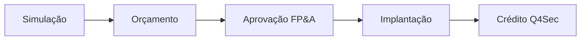

# Funding 2.0 - Sistema de Financiamento

Sistema completo de funding para facilitar a negociação com clientes através de parcelamento flexível com a Q4Sec.

## 🚀 Acesso Rápido

**[Acessar Hub Funding 2.0](https://bene-sysa.github.io/funding-2.0/)**

## 📋 Sobre o Projeto

O Funding 2.0 é um sistema web interativo que facilita o processo de financiamento de equipamentos para clientes, desde a simulação inicial até o recebimento do crédito da Q4Sec.

### Principais Funcionalidades

- **Calculadora Interativa**: Simula parcelas em 3 prazos diferentes (48/60/72 meses)
- **Documentação Completa**: Manual passo a passo para stakeholders
- **Templates Padronizados**: Modelos de e-mail para Q4Sec
- **Manual Institucional**: Guia interno para equipe FP&A

## 🎯 Fluxo do Processo



1. **Simulação pelo Comercial**: Uso da calculadora para simular parcelas
2. **Registro no Orçamento**: Inclusão do valor no sistema ERP
3. **Análise FP&A**: Validação e consulta ao Serasa
4. **Implantação**: Execução da obra conforme escopo aprovado
5. **Solicitação de Crédito**: Após ativação, solicitação do capital à Q4Sec

## 💰 Parâmetros Financeiros

| Parâmetro | Valor |
|-----------|-------|
| Taxa ao Cliente | 2,8% a.m. |
| Taxa Q4Sec | 2,4% a.m. |
| Margem Padrão | 35% |
| Prazos Disponíveis | 48, 60 ou 72 meses |

## 🛠️ Estrutura do Projeto

```
funding-2.0/
├── index.html                 # Hub principal
├── calculadora.html          # Calculadora de funding
├── documentacao.html         # Manual para stakeholders
├── manual-institucional.docx # Manual interno FP&A
├── README.md                 # Este arquivo
└── assets/
    ├── images/              # Prints e screenshots
    └── templates/           # Templates de documentos
        └── template-email-q4sec.html
```

## 🧮 Como Usar a Calculadora

1. Acesse o orçamento no ERP
2. Localize o campo "Valor de Comodato/Locação"
3. **IMPORTANTE**: Remova produtos da Matriz antes do cálculo
4. Digite o valor na calculadora
5. Escolha a melhor opção de parcelamento

### Exemplo de Cálculo

**Valor de Comodato/Locação**: R$ 57.411,94

| Prazo | PMT Cliente | Tempo de Retorno | Crédito Q4Sec | PMT Q4Sec |
|-------|-------------|------------------|---------------|-----------|
| 48 meses | R$ 2.189,10 | 27 meses | R$ 42.527,36 | R$ 1.501,70 |
| 60 meses | R$ 1.986,29 | 29 meses | R$ 42.527,36 | R$ 1.341,68 |
| 72 meses | R$ 1.863,78 | 31 meses | R$ 42.527,36 | R$ 1.241,15 |

## 📧 Template de E-mail para Q4Sec

O e-mail de solicitação deve conter **obrigatoriamente**:

- Filial
- CNPJ
- Prazo (48, 60 ou 72 meses)
- Data do Crédito
- Valor (custo real, sem margem)

[Ver template completo](assets/templates/template-email-q4sec.html)

## 📚 Documentação

### Para Stakeholders
- **Calculadora**: Ferramenta web interativa
- **Manual Web**: Documentação completa do processo
- **FAQ**: Perguntas frequentes e troubleshooting

### Para FP&A (Interno)
- **Manual Institucional**: Processo detalhado (Word)
- **Controles e Planilhas**: Ferramentas de gestão
- **Integração Serasa**: Configuração e uso

## ⚙️ Configuração Técnica

### Taxas Aplicadas

```javascript
const taxaCliente = 0.028;  // 2,8% a.m.
const taxaQ4Sec = 0.024;    // 2,4% a.m.
const markup = 1.35;        // 35% de margem
```

### Fórmula PMT

```javascript
PMT = (VP * taxa) / (1 - (1 + taxa)^-prazo)
```

### Cálculo de Retorno

```javascript
Tempo de Retorno = Math.ceil(Valor Total / PMT Cliente)
```

## 🔄 Atualizações Futuras

- [ ] Integração automática com ERP
- [ ] Dashboard de controle para FP&A
- [ ] Histórico de simulações
- [ ] Exportação de propostas em PDF
- [ ] API para consulta de taxas em tempo real

## 🤝 Contribuindo

Este é um projeto interno da Porter Group. Para sugestões ou melhorias:

1. Abra uma issue descrevendo a sugestão
2. Aguarde aprovação da equipe FP&A
3. Implemente as mudanças
4. Submeta um pull request

## 📞 Suporte

**Equipe FP&A**
- E-mail: fpa@portergroup.com.br
- Ramal: XXXX

**Dúvidas Técnicas (Sistema)**
- Desenvolvedor: Bernardo Kunz
- E-mail: bernardo.kunz@portergroup.com.br

## 📄 Licença

© 2025 Porter Group - Uso Interno

---

**Desenvolvido com ❤️ pela equipe Porter Group**